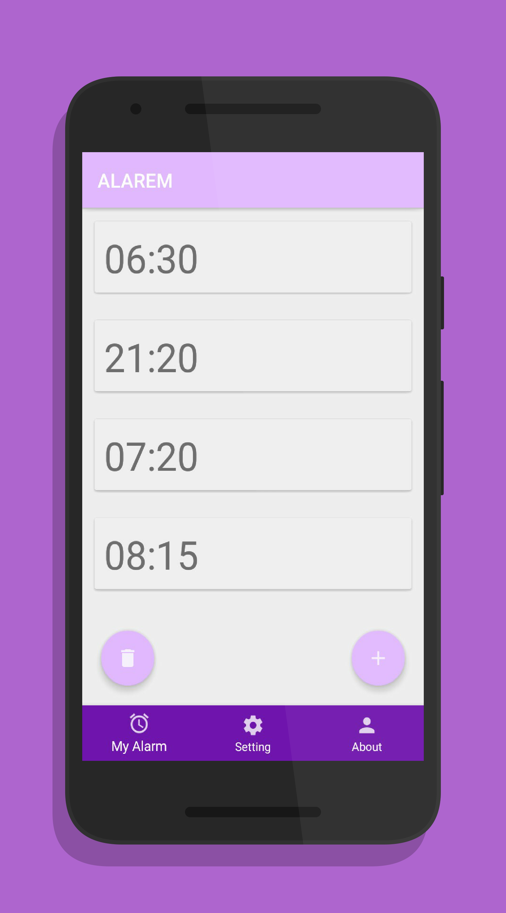

# ALAREM
Location-based Smart Alarm

# Deskripsi Umum Aplikasi

ALAREM adalah aplikasi alarm yang bekerja sesuai lokasi pengguna yang sudah ditentukan.  
Lokasi bisa ditentukan manual oleh pengguna dengan memasukkan koordinat atau bisa juga auto-detect.  
ALAREM berfungsi menggunakan dua sensor yaitu accelerometer dan proximity sensor.  
Pengguna bisa menggoyangkan smartphone atau melambaikan tangan pada layar untuk menonatktifkan alarm.  
Pengguna diwajibkan login agar data pengguna (jadwal, email, dan password) disimpan pada firebase database.  

# Panduan Instalasi Aplikasi
1. Buka bit.ly/ALAREM
2. Unduh dan install `ALAREM.apk`
3. Buka panduan lengkap penggunaan aplikasi pada (alarem_user_guide.pdf)

# Requirements
Minimal Android Ice Cream Sandwich 4.x

# IF3111 Platform Based Development
Bandung Institute of Technology, 2018
Developers
* Stevanno
* Gilang
* Rizki